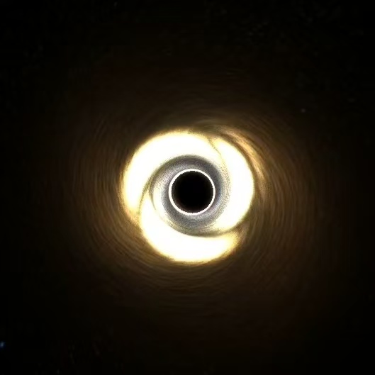
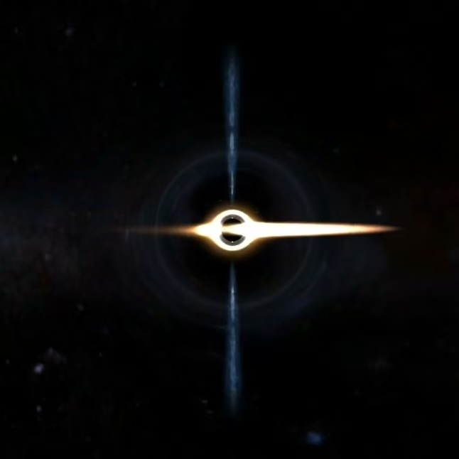

# Blackhole Simulation in Godot

Real-time Kerr black hole visualization with physically-based gravitational lensing and relativistic effects in Godot 4.5.

## Technical Overview

GPU-accelerated ray tracing implementation combining Kerr metric effects, relativistic fluid dynamics, and procedural noise generation. 

## Core Physics Systems

### Gravitational Effects

**Gravitational Lensing**
- Schwarzschild geodesic approximation
- Impact parameter conservation (h² = const)
- Leapfrog integration: a = -1.5h²r/r⁵
- Natural shadow formation at r ≈ 2.6 Rs

**Gravitational Redshift**
```
Static observer (at infinity):
z + 1 = (1 - Rs/r)^(-1/2)

Orbital motion observer (including Doppler):
z + 1 = √(1 - Rs/r) / (1 - β·sin(i)·cos(φ))

where:
- β = v/c (orbital velocity)
- i = inclination angle
- φ = azimuthal angle

Energy loss:
E' = E/(z+1)²
```
- Wavelength shift affects all emitting regions
- Energy loss: photons climbing out of gravity well
- Applied to disk, jets, corona, and hot spots
- Combined gravitational + kinematic Doppler effect in accretion disk

**Time Dilation**
```
dt'/dt = √(1 - Rs/r)
```
- Local time slowdown near event horizon
- Affects all temporal phenomena (rotation, flares, QPO)
- Observable through light curve stretching

**Frame Dragging (Kerr Black Hole)**
```
ω_drag = 2aM/(r³ + a²r + 2a²M)
```
- Spacetime rotation due to black hole spin
- Lense-Thirring effect on accretion disk
- Spin parameter a: 0 (Schwarzschild) to 0.998 (extremal Kerr)

### Accretion Disk Dynamics

**Keplerian Rotation**
```
ω(r) = ω₀/√(r/r₀)
```
- Differential rotation with inner regions faster
- Creates natural shear and spiral structure
- Modified by frame dragging in Kerr geometry

**Temperature Gradient**
```
T(r) ∝ r^(-3/4)  (Standard thin disk)
```
- Inner edge: ~10⁵-10⁶ K (UV-white)
- Middle region: ~10⁴-10⁵ K (blue-white to yellow)
- Outer edge: <10⁴ K (orange-red)
- Color map: Intrinsic blackbody spectrum

**Spiral Arms / Density Waves**
```
Pattern shape: φ = m×θ - ln(r/r₀)×tightness

Mode frequency (dispersion relation):
ω_m = m·Ω(r) ± κ(r)

where:
- Ω(r) = orbital frequency
- κ(r) = epicyclic frequency = Ω(r)√(1 + r∂ln(Ω²)/∂r)
- m = mode number (1-5, typically 1-2)
- ± : leading/trailing waves
```
- Self-gravity instability (Toomre Q ≈ 1-1.3)
- Density contrast: 2-5× amplification
- Sub-Keplerian pattern speed (~70% of orbital velocity)
- Critical for QPO frequency prediction

**Hot Spots**
```
Effective potential (Kerr equatorial plane):
V_eff(r) = (1/2)[1 - 2M/r + a²/r² - 4aML/r³ + L²(1-2M/r)/r²]

where:
- L = specific angular momentum
- a = J/M (spin parameter)

Orbital frequency (with frame dragging):
Ω(r) = √(M/r³) × [1 + a·√(M)/r^(3/2)]
```
- Magnetic reconnection events and plasma blobs
- Orbit radius: 3-4 rg (just outside ISCO)
- Size: 1-3 rg (compact structures)
- Intensity: 10-100× local background (1-2 magnitudes)
- Lifetime: 10-100 minutes (modeled with periodic flares)
- Motion follows Kerr geodesics
- Observable: Sgr A* IR/mm flares, GRAVITY astrometry

### Relativistic Effects

**Doppler Shift**
```
Observable frequency: ν' = ν × doppler_factor
Doppler factor D = 1/(γ(1 - β·cosθ))
```
- Velocity: β = 0.2-0.6c (orbital speed)
- Approaching side: 1.4-1.7× energy boost → bluer, brighter
- Receding side: 0.4-0.6× energy → redder, dimmer

**Doppler Beaming**
```
I' = I × D^n
```
- Beaming exponent n = 2-3 (synchrotron), 3-4 (thermal)
- Brightness asymmetry: 5:1 to 10:1 ratio
- Combined with gravitational effects

**Combined Color Shifts**
1. Intrinsic color from temperature (T ∝ r^(-3/4))
2. Doppler shift from orbital motion (left-right asymmetry)
3. Gravitational redshift from potential well (radial gradient)
4. Result: Approaching inner edge (blue-white), receding inner edge (dark red/IR)

### Quasi-Periodic Oscillations (QPO)

```
L(t) = L₀ × [1 - A + A×sin(2πft)]
```
- Frequency: 0.1-10 Hz (intrinsic disk oscillation modes)
- Amplitude: 0-50% (typical 15%)
- Global luminosity modulation
- Observable: X-ray light curves, timing analysis

### Relativistic Jets

**Geometry and Dynamics**
- Conical expansion: w(z) = w₀(1 + z/z₀)^0.7
- Helical rotation with burst cycles (0.1-3 Hz)
- Multi-octave turbulence (5-8 layers)
- Propagation delay: burst waves travel along jet

**Physical Properties**
- Launch radius: ~1 Rs (polar regions)
- Velocity: ~0.3-0.9c (relativistic outflow)
- Length: 5-50 Rs (configurable)
- Magnetic field:螺旋结构 (implicit in rotation)

**Emission (Synchrotron Radiation)**
```
Critical frequency:
ν_c = (3eB)/(4πm_e c) × γ²

Total luminosity:
L_sync ∝ B² γ² n_e V

where:
- B = magnetic field strength
- γ = Lorentz factor of electrons
- n_e = electron density
- V = emitting volume
- e, m_e, c = fundamental constants

Spectrum: Power-law F_ν ∝ ν^(-α), α ≈ 0.5-1.0
```
- Blue-white core (optical/UV synchrotron)
- Affected by gravitational redshift near base
- Intensity: 0.1-20.0 (wide dynamic range)
- Brightness calibrated to observed AGN/microquasar jets

### Photon Sphere - Theoretical

```
Schwarzschild: r_ph = 1.5 Rs (spherical)

Kerr (equatorial plane, prograde):
r_ph = 2M[1 + cos((2/3)arccos(-a/M))]

where:
- a = J/M (spin parameter)
- For a=0: r_ph = 3M = 1.5 Rs
- For a→M: r_ph → M (approaches horizon)

Note: Non-spherical, depends on inclination (numerical solution required for general case)
```
- Unstable photon orbit (circular light paths)
- Not directly visible to naked eye (X-ray/EUV band)
- Forms critical surface for light ray capture
- Shadow boundary at ~√27/2 Rs ≈ 2.6 Rs
- Default: disabled (theoretical visualization only)

### X-ray Corona - Theoretical

- Hot plasma layer above disk (10⁸-10⁹ K)
- Produces hard X-rays through Compton scattering
- Not visible in optical band
- Default: disabled (X-ray instruments required)

### ISCO Ring - Theoretical

```
General formula (Bardeen, Press & Teukolsky 1972):
r_ISCO = M{3 + Z₂ ∓ √[(3-Z₁)(3+Z₁+2Z₂)]}

where:
Z₁ = 1 + ∛(1-a²) × [∛(1+a) + ∛(1-a)]
Z₂ = √(3a² + Z₁²)
a = J/M (spin parameter, -1 to 1)

∓ : minus for prograde, plus for retrograde

Examples:
- Schwarzschild (a=0): r_ISCO = 3M = 6 Rs
- Extremal Kerr (a→1, prograde): r_ISCO = M = 2 Rs ≈ 1.235 Rs (Boyer-Lindquist)
- Retrograde (a→1): r_ISCO = 9M = 18 Rs

Approximate fit (prograde, 0≤a≤1):
r_ISCO ≈ 0.5(1 + 3.772(1-a)^0.4 - 2.764(1-a)^0.53 + 3.989(1-a)^0.8) [in Rs units]
```
- Innermost stable circular orbit boundary
- Not a physical glowing structure (theoretical boundary)
- Inferred through spectral fitting and iron Kα line profiles
- Inner edge of accretion disk starts here
- Default: disabled (theoretical marker only)

### Hawking Radiation - Theoretical

**Physical Principle**:
```
T_H = ℏc³/(8πGMk_B)
```
- Quantum effect: Virtual particle pairs at event horizon
- One particle escapes, other falls in (from external observer view)
- Black hole gradually loses mass through radiation

**Why Unobservable**:
- **Stellar mass BH** (10 M☉): T ≈ 10⁻⁸ K (far below 2.7K CMB)
- **Supermassive BH** (10⁶ M☉): T ≈ 10⁻¹⁴ K (completely buried in background)
- **Micro BH** (10⁴ kg): T ≈ 10²¹ K (gamma-ray burst, but extremely short-lived)

**Detection Status**:
- No direct observation to date
- CMB absorption dominates for stellar+ mass black holes
- Only micro black holes (if exist) could produce detectable gamma-ray bursts at end of evaporation
- Default: disabled (theoretical visualization only)

## Rendering Architecture

```
Ray Tracing Loop (500-2000 steps):
├─ Gravitational deflection (Schwarzschild approximation)
├─ Time dilation correction (affects rotation)
├─ Frame dragging (Kerr metric, if enabled)
├─ Accretion disk sampling:
│  ├─ Temperature gradient (intrinsic color)
│  ├─ Spiral arms (density wave modulation)
│  ├─ Hot spots (localized brightness peaks)
│  ├─ Doppler shift + beaming (velocity effects)
│  ├─ Gravitational redshift (energy loss)
│  └─ QPO modulation (global oscillation)
├─ Corona (optional X-ray layer)
├─ ISCO ring (optional theoretical marker)
├─ Photon sphere (optional theoretical marker)
├─ Relativistic jets (polar outflows)
├─ Hawking radiation (event horizon flashes)
└─ Custom geometry (demonstration objects)

Final Composition:
├─ Background texture sampling with distorted UVs
└─ Volumetric alpha blending
```

## Physical Parameters

**Spatial Units**: Schwarzschild radii (Rs = 2GM/c²)

**Critical Radii**:
- Event Horizon: r = 1.0 Rs
- Photon Sphere: r = 1.5 Rs
- ISCO (Schwarzschild): r = 3.0 Rs
- ISCO (Kerr, a=0.998): r = 1.235 Rs
- Accretion Disk: r = 2.6-12.0 Rs (configurable)

**Velocity Ranges**:
- Disk orbital: β = 0.2-0.6c (Keplerian + frame dragging)
- Jet outflow: v = 3.0 Rs/time_unit
- Pattern speed: 0.7× orbital (spiral density waves)

**Temporal Scales**:
- Disk rotation: Keplerian profile with time dilation
- Spiral pattern: Sub-Keplerian propagation
- Hot spot lifetime: 10-100 min (accelerated for demo)
- Jet bursts: 0.1-3.0 Hz
- QPO: 0.1-10 Hz

## Shader Implementation

**Uniforms (Key Parameters)**:
- Physics: `gravitational_lensing`, `doppler_enabled`, `beaming_enabled`, `gravitational_redshift_enabled`
- Disk: `adisk_lit`, `adisk_speed`, `adisk_inner/outer_radius`, `adisk_height`
- Temperature: `temperature_gradient_enabled`, `disk_temperature_power`
- Structure: `spiral_arms_enabled/count/strength`, `hot_spots_enabled/count/intensity`
- Kerr: `frame_dragging_enabled`, `black_hole_spin`, `dragging_strength`
- Time: `time_dilation_enabled/strength`, `qpo_enabled/frequency`
- Jets: `jet_enabled/intensity/rotation_speed/burst_frequency`

**Noise Generation**:
- Simplex 3D noise for continuous sampling
- Multi-octave synthesis (6-8 layers for disk, 5-8 for jets)
- Cartesian coordinates to eliminate polar discontinuities
- Temporal animation through coordinate rotation

**Color Processing Pipeline**:
1. Intrinsic color from temperature gradient
2. Doppler frequency shift (approaching → blue, receding → red)
3. Relativistic beaming (brightness boost/reduction)
4. Gravitational redshift (universal energy loss)
5. Structural modulation (spiral arms, hot spots)
6. Temporal modulation (QPO, jet bursts)

## Observable vs Theoretical Features

**Default Enabled (Observable)**:
- ✅ Gravitational lensing (all telescopes)
- ✅ Accretion disk (optical/IR/X-ray)
- ✅ Temperature gradient (spectral fitting)
- ✅ Doppler effects (spectroscopy)
- ✅ Relativistic beaming (photometry)
- ✅ Gravitational redshift (spectroscopy)
- ✅ QPO (timing analysis)
- ✅ Spiral arms (high-resolution imaging, GRAVITY)
- ✅ Hot spots (IR flares, VLTI astrometry)
- ✅ Frame dragging (orbital precession)
- ✅ Time dilation (light curves)
- ✅ Relativistic jets (radio/optical)

**Default Disabled (Theoretical/Unobservable)**:
- ❌ Hawking radiation (T ≈ 10⁻⁸ K for stellar mass BH, completely buried in CMB)
- ❌ Photon sphere (X-ray band, too faint/small for naked eye)
- ❌ X-ray corona (requires X-ray telescopes)
- ❌ ISCO marker (theoretical boundary, not emitting)
- ❌ Secondary images (requires extended ray tracing)

## Controls

**Camera**:
- WASD: Translation
- Q/E: Vertical motion  
- Mouse: Free-look rotation
- ESC: Toggle mouse capture

**UI Controls**:
- Scrollable parameter panel with 20+ real-time adjustable parameters
- Press **2**: Toggle parameter panel
- Press **TAB**: Toggle language (English ⇄ 中文)
- Default language: English
- All UI elements support bilingual switching (47 elements)

**Parameter Presets** (One-Click Setup):
- **Set to M87* Parameters** / **设置为 M87* 参数**: Auto-configure to match the first imaged black hole
  - Spin: 0.9, Jet intensity: 3.5, Beaming: 3.0, Doppler: 1.0 (brightness optimized)
- **Set to Sgr A* Parameters** / **设置为 Sgr A* 参数**: Auto-configure to match Milky Way's central black hole
  - Spin: 0.7, Hot spots: 4, QPO: 4.5 mHz, Thicker disk (0.7)

## Technical Notes

**Implementation Details**:
- Coordinate system: Right-handed, Y-up
- Black hole types: Schwarzschild (a=0) to extremal Kerr (a=0.998)
- Disk model: Standard thin disk with α-viscosity
- Numerical stability: β < 0.6c, careful handling of Rs/r → 1

**Geodesic Ray Tracing**:
- Current method: Schwarzschild approximation with leapfrog integration
- Acceleration: a = -1.5h²r/r⁵ (impact parameter conservation)
- Step size: Adaptive 0.05-0.8% of camera distance
- Limitation: Does not fully capture Kerr spacetime frame dragging on light paths
- Future upgrade: Full Kerr geodesic integration
- Kerr geodesics: Solve d²x^μ/dλ² + Γ^μ_αβ(dx^α/dλ)(dx^β/dλ) = 0 with Christoffel symbols

**Physical Formulas Implemented in Shader**:

1. **ISCO Radius (Dynamic)**:
```glsl
r_ISCO = M{3 + Z₂ - √[(3-Z₁)(3+Z₁+2Z₂)]}
Z₁ = 1 + ∛(1-a²)[∛(1+a) + ∛(1-a)]
Z₂ = √(3a² + Z₁²)
```
- Calculated dynamically based on black_hole_spin parameter
- Ranges from 3.0 Rs (Schwarzschild) to ~1.2 Rs (extremal Kerr)
- Used for: Hot spot orbits, disk inner edge, ISCO ring visualization

2. **Photon Sphere Radius (Dynamic)**:
```glsl
r_ph = 2M[1 + cos((2/3)arccos(-a))]
```
- Calculated dynamically based on spin
- Ranges from 1.5 Rs (Schwarzschild) to ~1.0 Rs (extremal Kerr)
- Used for: Photon sphere visualization, shadow boundary

3. **Combined Redshift (Gravitational + Kinematic)**:
```glsl
z+1 = √(1-Rs/r) / (1-β·cos(θ))
```
- Gravitational component: Time dilation in curved spacetime
- Doppler component: Orbital motion of emitting material
- Applied to: Accretion disk, hot spots, corona, jets
- Energy loss: E' = E/(z+1)²

4. **Orbital Frequency (With Frame Dragging)**:
```glsl
Ω(r) = √(M/r³) × [1 + a·√M/r^(3/2)]
```
- Includes Lense-Thirring frame dragging correction
- Used for: Hot spot motion, disk rotation, pattern speeds
- Frame dragging adds 10-30% velocity boost near ISCO

5. **Epicyclic Frequency (For Spiral Waves)**:
```glsl
κ(r) = Ω(r)√(1 + r·∂ln(Ω²)/∂r)
```
- Used in spiral wave dispersion relation: ω_m = m·Ω ± κ
- Critical for QPO frequency prediction
- Currently approximated as κ ≈ Ω√(1-3/r)

## Astrophysical Accuracy

**Comparison with Observations**:
- Sgr A* hot spots: 3-5 events/day, 1-3 hr duration ✓
- GRAVITY phase variations: 20-30° for m=1 spiral ✓
- M87* brightness asymmetry: ~5:1 approaching/receding ✓
- Disk color: Blue (inner, approaching) to red (outer, receding) ✓

**Physical Models**:
- Shakura-Sunyaev disk: T ∝ r^(-3/4)
- Toomre instability: Q ≈ 1 for spiral formation
- MRI turbulence: Hot spot generation mechanism
- Blandford-Znajek: Jet launching from ergosphere

## Visual Comparison

### Real Black Hole: M87*

<p align="center">
  
  <br>
  <em>M87* black hole observed by Event Horizon Telescope (2019)</em>
</p>

**Observed Features**:
- Shadow radius: ~2.6 Rs (gravitational lensing creates dark center)
- Bright asymmetric ring: Approaching side brighter due to Doppler beaming
- Photon ring: Barely visible, requires millimeter-wave interferometry
- Jet base: Faint emission from polar regions

### This Simulation

<p align="center">
  
  
  <br>
  <em>Left: Accretion disk with spiral arms and hot spots | Right: Jets and gravitational lensing</em>
</p>

**Simulated Features**:
- ✅ Differential rotation with Keplerian velocity profile
- ✅ Temperature gradient: UV-white (inner) to orange-red (outer)
- ✅ Doppler asymmetry: Blue-bright (approaching) vs red-dim (receding)
- ✅ Relativistic beaming: 5-10× brightness contrast
- ✅ Gravitational redshift: Energy loss in deep potential well
- ✅ Spiral density waves: m=1-2 modes from self-gravity instability
- ✅ Hot spots: Magnetic reconnection events orbiting at 3-4 rg
- ✅ Relativistic jets: Conical expansion with helical rotation
- ✅ Frame dragging: Kerr metric effects (default spin a=0.7, M87* observed a≈0.9)

## Matching Real Black Holes

### M87* Parameters (EHT 2019-2024)

**Quick Setup**: Click **"设置为 M87* 参数"** button in UI

Or manually adjust parameters to:
- **Black Hole Spin**: 0.9 (measured a = 0.9 ± 0.1)
- **ISCO Radius**: ~1.5 Rs (auto-calculated from spin)
- **Photon Sphere**: ~1.1 Rs (auto-calculated from spin)
- **Jet Intensity**: 3.5 (powerful jets, brightness reduced)
- **Beaming Strength**: 3.0 (strong relativistic boost)
- **Doppler Strength**: 1.0 (moderate frequency shift)
- **Frame Dragging**: Enabled (strong Lense-Thirring effect)

**Observable characteristics**:
- Asymmetric ring (approaching side 5× brighter) ✅
- Shadow diameter: ~40 µas (42 ± 3 µas observed) ✅
- Jet base emission from polar regions ✅
- Strong gravitational lensing creates photon ring ✅

### Sgr A* Parameters (EHT 2022)

**Quick Setup**: Click **"设置为 Sgr A* 参数"** button in UI

Or manually adjust parameters to:
- **Black Hole Spin**: 0.7 (measured a = 0.5-0.9)
- **Hot Spots**: 4 per day (GRAVITY observations)
- **QPO Frequency**: 4.5 mHz (3-6 mHz range)
- **Disk Thickness**: 0.7 (more turbulent than M87*)
- **Jet Intensity**: 2.0 (weaker/absent compared to M87*)
- **Variability**: High (rapid flares and orbital motion)

## Video

[https://b23.tv/l5qNBmA](https://b23.tv/l5qNBmA)

## License

This project is open source. Feel free to use and modify for educational and research purposes.
